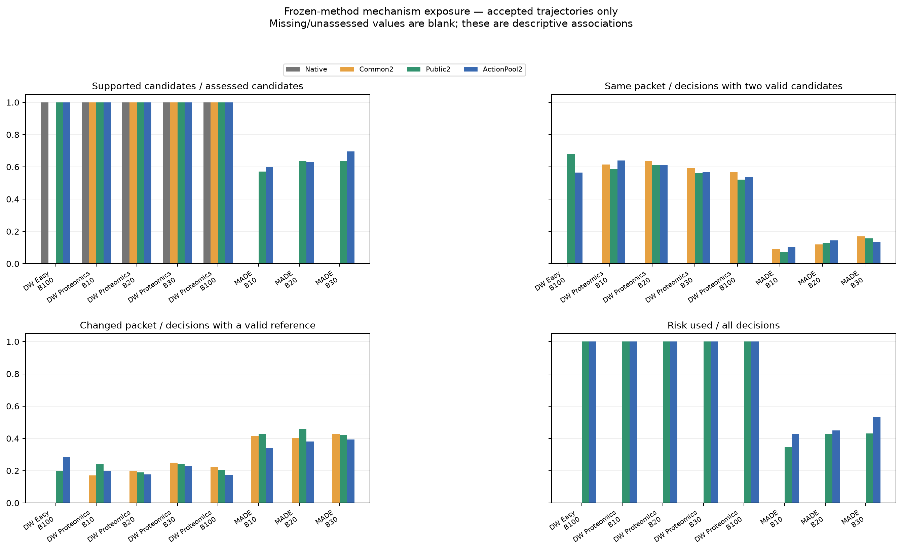
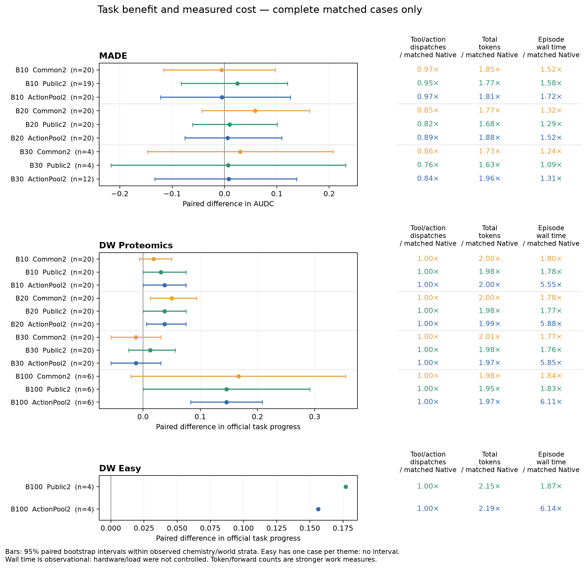

# 冻结内部风险信号：P1审计与P2前两条阶段结果

**现有证据尚不支持加入内部特征后稳定提高任务收益。P2目前仅完成2/8条，不能据此证实或否定风险排序效用。** 结果不混入旧ES、不同模型规模或未完成轨迹。

## P1：既有数据的探索性审计

P1读取窗口：2026-09-24 23:04:40—23:22:01（北京时间）。这是顺序文件快照，不是当前在线状态。共468条接受轨迹：MADE主比较105/120、Common/Public消融87/120、DW Proteomics264/264、官方Easy12/80。P1协议在计算前提交，但这些开发体系/结果此前已被查看，所以全部仍为探索性分析。

- DW K2的两有效候选重复率为52%—64%；ActionPool真正换动作仅17.5%—23%。支持率100%仅指特征/schema映射可计算，不代表新任务已校准。MADE风险实际参与42.9%—53.3%的决策。
- MADE B10/B20 ActionPool−Native的AUDC差为−0.0050/+0.005875；条件95%区间均跨0，token为Native的1.81×/1.88×。B20 Common阶段均值最高。
- DW B100 ActionPool与Public平均任务进度同为0.27083，任务成功均为0。两者各生成200候选/episode；ActionPool另有400次capture forward。
- 原开发样本上，MADE P+C−P的Brier变化仅−0.000652；DW为+0.015206（更差），虽然DW AUROC增加0.020。100次同role/体系或world/动作类型内C块置乱是表征诊断，不是反事实轨迹实验。

**墙钟只是观测成本。** 例如DW B100 ActionPool/Public的episode wall账本比值为3.33×，但未控制完全相同硬件、负载和计时窗口，不能称为因果速度差或纯算法开销。任务/seed/冻结G0的配对保留；token、generation及capture-forward计数是更直接的工作量证据。图中的调用列为工具/动作dispatch，不冒充全部RPC或oracle调用。

## P2：00:27快照，仅 n=2，方向混合

2026-09-25 00:27快照：RiskShuffle2为 **2 accepted、1 claimed、5 unclaimed**。claimed不是新鲜进程活跃证明。32个固定历史比较身份保留，Public的一项既有失败不重跑、不换seed、不补零。此前n=1版本仅为未发布草稿，保留并由本快照替代。

| 固定case | Native SUN/AUDC | Common | Public | ActionPool | RiskShuffle |
|---|---:|---:|---:|---:|---:|
| Au-K-Tb / B10 / 501 | 0 / 0.00 | 3 / 0.39 | 1 / 0.17 | 1 / 0.17 | 1 / 0.09 |
| Mg-Sn-Sr / B10 / 501 | 8 / 0.86 | 9 / 0.93 | 历史失败，缺失 | 9 / 0.95 | 10 / 1.00 |

主比较RiskShuffle2−ActionPool2：B10 **2/4对，mSUN均值差+0.05**；AUDC均值差 **−0.015**。两条的AUDC差分别−0.08、+0.05，方向混合。B20为0/4对，均值为缺失。不能由两条完成记录推断稳定的风险排序收益。

Au-K-Tb：15次决策中9次具备两完整风险分数，6次交换并实际改变动作，无平分或相同动作包。Mg-Sn-Sr：23次决策中10次具备两完整风险分数，5次交换；5次索引变化只有3次真正改变动作，另有6个同动作包状态，无平分。置乱的是整个P+C分数，不能单独识别内部特征增量；ActionPool2−Public2仍是对应对照。状态分叉后后续候选可自然不同；未选候选没有结果标签。

## 解释边界与复核

P1区间按完整case跨臂联合、在既有chemistry/world内重采样；两个MADE体系和两个Proteomics世界不足以支持任务泛化。Easy仅每主题1个API seed且Common尚缺，没有完整四臂组。全零成功的bootstrap退化区间不证明总体成功率精确为零。在线P与P+C风险指标来自各自已执行轨迹，不是同样本比较。

`p1_per_trajectory.csv`保留584个登记单元状态；`p2_every_case.csv`保留8个control与32个固定比较身份。其余JSON/CSV包含全部精度、配对数、负向/空结果和成本。`python validate.py`无需GPU即可复核公开数据的计数、均值、差值和原离线预测指标；bootstrap/置乱摘要通过来源哈希绑定。没有发布主机、认证、原始prompt/token或tensor数据；数值token计数仅用于成本报告。
