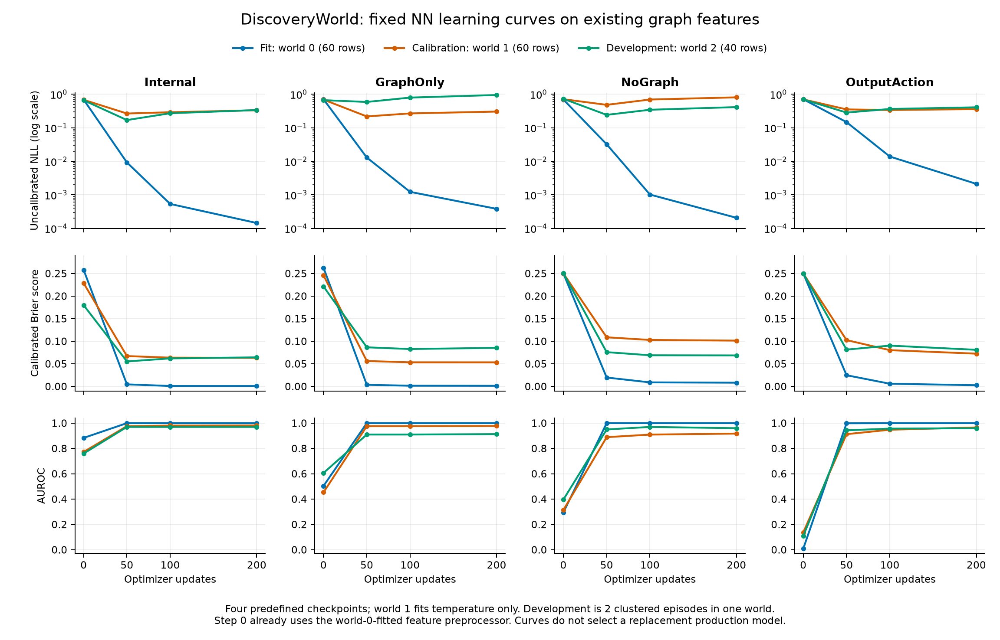

# DiscoveryWorld: completed CPU feature and operating-point diagnostics

Feature/cached-risk observation: **2026-09-22T17:12:44.559813+08:00**. Additional training diagnostic: **2026-09-22T17:22:56.356917+08:00**. Qwen3.5-4B, **Proteomics Normal**, development evidence only.

**Four feature-family fits completed. A fixed 0.5 threshold flags more failures in cached predictions, but no online failure reduction or completed Full-method result is established by these diagnostics.**

## Feature-family comparison

The fixed split contains 60 fitting rows from three world-0 episodes, 60 calibration rows from three world-1 episodes, and 40 development rows from two world-2 episodes. All four prespecified families use the original train-only preprocessing, error-prototype terms, two 64-unit hidden layers, 200 NN optimizer updates and temperature calibration. The existing 160 graphs were reused.

| Features | Raw fields | NN parameters | AUROC ↑ | Brier ↓ | NLL ↓ |
|---|---:|---:|---:|---:|---:|
| OutputAction | 10 | 5761 | 0.9600 | 0.08107 | 0.25350 |
| NoGraph | 140 | 22401 | 0.9600 | 0.06871 | 0.23688 |
| GraphOnly | 153 | 24065 | 0.9133 | 0.08545 | 0.42457 |
| Internal | 293 | 41985 | 0.9700 | 0.06444 | 0.19994 |

OutputAction has six sampling and four action features. NoGraph adds 130 hidden-state summaries. GraphOnly uses 153 graph statistics; Internal combines all 293 fields. Model capacities differ, so this is **not a capacity-matched causal decomposition**.

GraphOnly is weaker than OutputAction on the pooled metrics, and its two episode AUROCs are 0.8132 and 1.0000. Internal minus NoGraph is +0.0100 AUROC and −0.00428 Brier. These descriptive differences do not establish significance, broad generalization, or a downstream benefit from graph features. The 40 steps are clustered within two episodes in one world.

All four diagnostic fits completed in **46.02 seconds**, with **800 optimizer updates**. The Internal and OutputAction reproduction controls match the prior recorded tensor hashes and metrics exactly. These repeated diagnostic fits do not create new simulator trajectories or new graphs, and no diagnostic family replaces the production predictor.

## Separate training and classifier diagnostic

A separate completed CPU run reports **four NN fits plus four classical fits**, **16 NN states** at updates0/50/100/200, and all fit/calibration/development metrics. It took53.88s, with800 NN optimizer updates and no new graphs, language-model calls, environment calls or held-out outcome reads. This reuses the same action corpus; it is not a new independent validation set or additional simulator evidence.

Internal's uncalibrated fit NLL falls from0.009203 at50 updates to0.000144 at200, while uncalibrated development NLL rises0.169148→0.336776. Calibrated development Brier rises0.055349→0.064438, with AUROC unchanged at0.9700. This pattern is consistent with late overfitting/overconfidence on this split; it neither proves that50 updates generalizes best nor shows that the signal is useless. The production200-update NN remains frozen.

The recorded full-feature GBC and L2-logistic probes have development AUROC0.9417 and0.9633, respectively, versus the NN's0.9700. GraphOnly GBC/L2 AUROCs are0.8500/0.9000 versus NN0.9133, while their NLLs are lower than GraphOnly NN. Ranking and probability accuracy therefore do not support a single blanket conclusion. These are fixed classifier probes on the present features, not a reproduction of the full CRV method.

**Step0 already uses the world-0-label-fitted error prototype and feature preprocessing. It is not a wholly unlearned random baseline.** No displayed checkpoint or classifier was selected to replace production using development outcomes. GBC's recorded `converged` flag means no ConvergenceWarning, not a numerical gradient-convergence result.

The same frozen action corpus supplies all four feature families; NoGraph and OutputAction exclude graph statistics. [All108 metric rows](training_metrics.csv), [fit status](classical_fit_status.csv), [PDF](learning_curves.pdf), [editable SVG](learning_curves.svg), and the [detailed training audit](training_diagnostic_report.md) retain every prescribed state/model.

## Fixed 0.5: cached-prediction diagnostic

The original threshold is 0.9867005323. The alternative 0.5 probability threshold was fixed before this cached calculation under unit false-negative/false-positive risk-alarm costs; no threshold search or new fit was performed. Both rules use the same frozen temperature-scaled probabilities.

| Partition | Rows | Flagged: original → 0.5 | Failure recall: original → 0.5 | False positives: original → 0.5 |
|---|---:|---:|---:|---:|
| Calibration | 60 | 15 → 24 | 15/26 → 22/26 | 0 → 2 |
| Development | 40 | 1 → 13 | 1/10 → 10/10 | 0 → 3 |
| G0 development | 10 | 0 → 6 | 0/7 → 6/7 | 0 → 0 |

These are flags on **already executed actions**. They do not show that generating or selecting a revision would prevent those failures. Brier scores remain unchanged because the probabilities are unchanged. The G0 record is world 2/policy seed 303/B10, not a held-out Full test.

The preceding prediction audit used one frozen small-NN CPU batch for 60 calibration rows and reused 40 development plus 10 G0 predictions. This publication reuses those results; it performs no NN forward, fit, graph extraction, language-model call or environment call. The empirical Q75 boundary used float64 during original calibration and float32 online, giving 16 versus 15 calibration flags; the table preserves the **online** 15. That one boundary difference does not explain G0 inactivity.

## Status and limits

The original V4 Full branch stopped at the G0 activity gate before any ES parameter perturbation/update. Its failure and the original Baseline remain unchanged. The separately registered online operating-point pair, matched-proposal control and Full ES continuation are not completed results in this bundle. There is no new Baseline–Full effect estimate. MADE remains 1079 valid evaluations plus one preserved technical failure, with negative aggregate Full-minus-Native differences at all three budgets.

The active study focus is MADE and DiscoveryWorld; this release does not establish completion of a larger benchmark or model-scale matrix. No outcomes here select a production NN, threshold, policy checkpoint or held-out seed.

## Reproducibility

Run `python3 -B validate.py`. The portable checker recomputes all cached threshold confusion counts, recall and Brier values; checks feature dimensions, parameter counts, equal-episode Brier/NLL pooling, reported differences, and both reproduction controls against the prior public snapshot; and verifies all bundle hashes and privacy constraints. Feature-family AUROCs are source-reported values, not all reconstructed from raw per-family predictions in this export. Source receipt hashes and the recorded protocol identifiers are preserved without private runtime metadata or model checkpoints.
